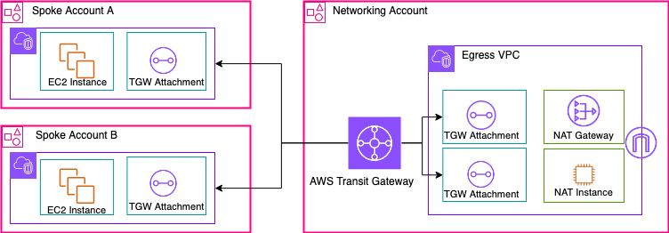

# terraform-aws-network-foundation

A Terraform module to provision a **Hub-and-Spoke AWS Network Foundation** using Transit Gateway and a Transit VPC.  
It enables secure and scalable inter-VPC communication, optional VPC Flow Logs, and centralized NAT Gateway support.




---

## 🚀 Features

- Creates a Transit Gateway (TGW) with RAM sharing enabled
- Provisions a Transit VPC with public and private subnets
- Attaches other VPCs (Spokes) via Transit Gateway
- Configurable routes between Spoke VPCs (allowlist)
- Adds routes in all Transit VPC route tables pointing to Spoke CIDRs
- Optional VPC Flow Logs support (to S3)
- Supports shared VPC deployments across accounts and environments

---

## 📦 Module Usage

```hcl
module "network_foundation" {
  source  = "yroscloud/network-foundation/aws"
  version = "1.0.0"

  project     = "myproject"
  environment = "hub"  # hub or shared or network whatever
  region      = "us-east-1"

  az_count                     = 3
  vpc_transit_cidr             = "10.112.0.0/16"   # 65,536 IPs total for Transit VPC
  vpc_transit_public_base_cidr = "10.112.240.0/21"   # 2,048 IPs (base block for 8 x /24 subnets)
  subnet_newbits               = 3                 # Creates 8 subnets of /24 (256 IPs each)
  single_nat_gateway        = false

  ram_principals = [
    "111122223333",
    "222233334444"
  ]

  vpc_attachments = {
    development = {
      cidr            = "10.120.0.0/16"
      route_table_ids = []
      account_id      = "111122223333"
    },
    production = {
      cidr            = "10.121.0.0/16"
      route_table_ids = []
      account_id      = "222233334444"
    }
  }

  tgw_routes_allow = [
    { from = "development", to = "production" },
    { from = "production", to = "development" }
  ]

  enable_vpc_flow_logs      = true
  vpc_flow_logs_bucket_name = "" # leave empty to auto-create

  tags = {
    Owner       = "InfraTeam"
    Environment = "hub"
  }
}
```

---

## 📥 Input Variables

| Name                           | Type           | Description                                               | Default | Required |
|--------------------------------|----------------|-----------------------------------------------------------|---------|----------|
| `project`                      | `string`       | Project name prefix                                       | n/a     | ✅        |
| `environment`                  | `string`       | Environment name (e.g., dev, staging, prod)               | n/a     | ✅        |
| `az_count`                     | `number`       | Number of AZs to use                                      | `3`     | ❌        |
| `vpc_transit_cidr`             | `string`       | CIDR block for the Transit VPC                            | n/a     | ✅        |
| `vpc_transit_public_base_cidr` | `string`       | Base CIDR to split public subnets                         | n/a     | ✅        |
| `subnet_newbits`               | `number`       | Number of bits to add when creating subnets               | `4`     | ❌        |
| `single_nat_gateway`           | `bool`         | Use single NAT Gateway across all AZs                     | `true`  | ❌        |
| `ram_principals`               | `list(string)` | AWS Account IDs allowed to use TGW via RAM                | `[]`    | ✅        |
| `vpc_attachments`              | `map(object)`  | Map of VPCs to attach with their CIDR and route table IDs | n/a     | ✅        |
| `tgw_routes_allow`             | `list(object)` | List of allowed routes between spokes                     | `[]`    | ❌        |
| `enable_vpc_flow_logs`         | `bool`         | Enable VPC Flow Logs                                      | `false` | ❌        |
| `vpc_flow_logs_bucket_name`    | `string`       | Optional bucket name for VPC flow logs                    | `""`    | ❌        |
| `tags`                         | `map(string)`  | Common tags for all resources                             | `{}`    | ❌        |

---

## 📤 Outputs

| Name                        | Description                                  |
|-----------------------------|----------------------------------------------|
| `transit_gateway_id`        | ID of the created Transit Gateway            |
| `transit_vpc_id`            | ID of the created Transit VPC                |
| `transit_nat_gateway_ips`   | Public IPs of the Transit NAT Gateway(s)     |
| `vpc_flow_logs_bucket_name` | Name of the S3 bucket used for VPC Flow Logs |

---

## 🛡️ Route Control

You can allow communication between Spokes explicitly via the `tgw_routes_allow` variable:

```hcl
tgw_routes_allow = [
  { from = "development", to = "production" },
  { from = "production", to = "development" }
]
```

By default, all Spokes can communicate with the Hub,  
but Spoke-to-Spoke communication **must be explicitly allowed**.

---

## 📚 Module Structure

This module includes:

- **Transit Gateway (TGW)**
- **Transit VPC** with public/private subnets
- **TGW Attachments** to the Hub
- **Dynamic Routing logic**
- **Optional S3 VPC Flow Logs**

---

## 🧪 Requirements

- **Terraform** >= 1.3.0  
- **AWS Provider** >= 5.0

---

## 📝 License

MIT © [Yros Cloud](https://github.com/yrosaguiar)

---

## 🤝 Contributions

Contributions and pull requests are welcome!  
Please open an issue or fork the repository.

---
